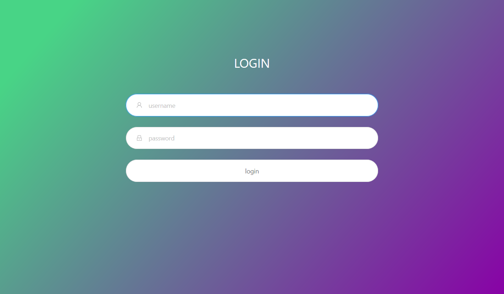

[中文](README.md) | English

# v2-ui
Support multi-protocol multi-user v2ray panel

# Help translate
The panel currently supports Chinese and English. If you find the wrong translation to help you fix, or want to help translate into more languages, you can find translations for each language in the translations folder, such as [translations/zh/LC_MESSAGES/message.po](translations/zh/LC_MESSAGES/messages.po) files It is Chinese translation content. Where msgid is the original English text, msgstr is the translated content, and each msgid corresponds to a msgstr.

Of course, the document currently only supports Chinese and English. If you want to help with translation, create a file README.lang.md, where lang is the English abbreviation for the language, for example, en for English.

# Screenshot



# Features
 - System status monitoring
 - Support multi-user multi-protocol, browser visualization operation, no need to type command
 - Supported protocols: vmess, shadowsocks, dokodemo-door, socks, http
 - Transport supported: tcp (http camouflage, tls), kcp (camouflage), ws(tls), http(tls), quic(tls)
 - Support account traffic statistics
 - Support for custom v2ray configuration templates
 - Support https access panel (requires own domain name + ssl certificate)
 - More advanced configuration items, see the panel
 
# Install & Upgrade

## User notes (must see)
V2-ui is completely incompatible with all other tools for modifying v2ray configuration files (including sprov-ui).

Installing v2-ui will cause the v2ray configuration file to be rewritten, resulting in the loss of the original v2ray account.

If necessary, please make a backup in advance to avoid unnecessary consequences.

## Suggestion system
 - CentOS 7+
 - Ubuntu 16+
 - Debian 8+

## One command installation & upgrade
```
bash <(curl -Ls https://blog.sprov.xyz/v2-ui.sh)
```

# Other operations
```
v2-ui                  # Display management menu (More features)
v2-ui start            # Start v2-ui panel
v2-ui stop             # Stop v2-ui panel
v2-ui restart          # Restart v2-ui panel
v2-ui status           # Show v2-ui status
v2-ui enable           # Set v2-ui boot
v2-ui disable          # Cancel v2-ui boot
v2-ui log              # Show v2-ui logs
v2-ui update           # Upgrade v2-ui panel
v2-ui install          # Install v2-ui panel
v2-ui uninstall        # Uninstall v2-ui panel
```

## Data Backup and Migration
All data on the panel, including account information, are stored in /etc/v2-ui/v2-ui.db, just back up this file.

After installing the panel on the new server, close the panel, then overwrite the newly installed file with the backup file, and finally start the panel.

# Common problem
## After installing, can't open the panel.
Check the panel status, make sure that the 65432 port has been released after running.

## How to customize the v2ray config.json
Go to [panel settings] and there is a [v2ray config template]. You can modify the configuration template here, for example, modify the routing, add a mtproto yourself, etc. If you are not familiar enough with the v2ray configuration file, then it is recommended to learn more from the v2ray official documentation.

## Forgot username and password
Use the following command to reset the username and password, the default is admin.
```
/usr/local/v2-ui/v2-ui resetuser
```
## Panel setting modification error caused the panel to fail to start
Use the following command to reset all panel settings, the default panel port is modified to 65432, and the others are reset to their default values.

Note that this command does not reset the username and password.
```
/usr/local/v2-ui/v2-ui resetconfig
```

## Panel failed to start
### appears：‘ascii’ codec can’t encode characters in position 0-6: ordinal not in range(128)
This is because the system code does not support UTF-8, and the system code can be set to UTF-8. Please search for the method yourself.

## Where is restart v2ray button?
This panel is different from the way that sprov-ui manually restarts v2ray.

In the automatic mode, when adding, modifying, and deleting accounts, the v2ray configuration file is automatically updated in 60 seconds by default, and v2ray is restarted.

You can modify the [Account Effective Time] in the panel settings, **It is not appropriate to set a small value**, otherwise the CPU usage will increase.

## Vmess cannot be connected due to time error
Refer to v2ray official sentence:
>VMess depends on system time. Please ensure that your system time is in sync with UTC time. Timezone doesn't matter. One may install ntp service on Linux to automatically adjust system time.

# Telegram
群组：https://t.me/sprov_blog
频道：https://t.me/sprov_channel
