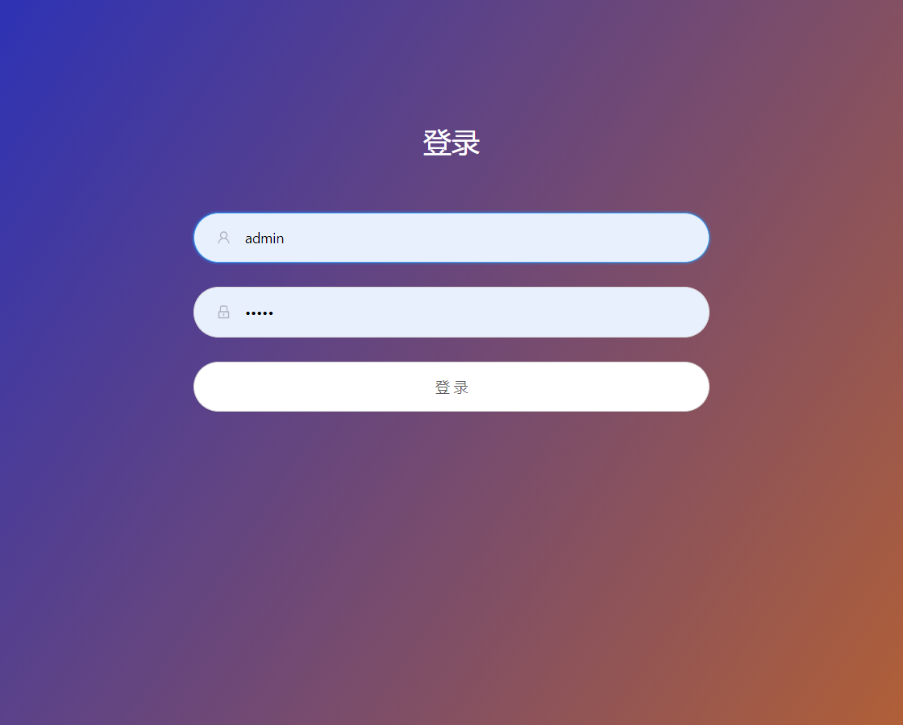
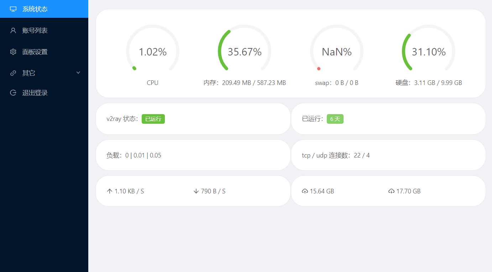

中文 | [English](README.en.md)

# v2-ui
支持多协议多用户的 v2ray 面板，Support multi-protocol multi-user v2ray panel

# 帮助翻译
面板目前支持中文与英文，如果你发现了错误的翻译想帮助修正，或者想帮助翻译成更多的语言，可以在 translations 文件夹中找到各语言对应的翻译，例如 [translations/zh/LC_MESSAGES/message.po](translations/zh/LC_MESSAGES/messages.po) 文件是中文翻译内容。其中 msgid 是英文原文，msgstr 是翻译后的内容，每个 msgid 对应一个 msgstr。

当然，文档目前也只支持中文和英文，如果你想帮助翻译，那么创建一个文件 README.lang.md，lang 是该语言的英文缩写，例如 en 代表英文。

# 详细教程
https://blog.sprov.xyz/v2-ui/

# 运行截图



# 功能介绍
 - 系统状态监控
 - 支持多用户多协议，浏览器可视化操作，无需敲命令
 - 支持的协议：vmess、shadowsocks、dokodemo-door、socks、http
 - vmess 支持的传输配置：tcp（http伪装、tls）、kcp（伪装）、ws（tls）、http（tls）、quic（tls）
 - 支持账号流量统计
 - 支持自定义 v2ray 配置模板
 - 支持 https 访问面板（需自备域名 + ssl 证书）
 - 更多高级配置项，详见面板
 
# 安装&升级

## 用户注意事项（必看）
v2-ui 与其它所有关于修改 v2ray 配置文件的工具***完全不兼容***（包括 sprov-ui），安装 v2-ui 后会导致 v2ray 配置文件被重写，导致原有 v2ray 账号丢失，如有必要，请自行提前做好备份，以免造成不必要的后果。

## 建议系统
 - CentOS 7+
 - Ubuntu 16+
 - Debian 8+

## 一键安装&升级
```
bash <(curl -Ls https://blog.sprov.xyz/v2-ui.sh)
```

## 手动安装&升级
### 手动安装 v2ray
无需手动安装 v2ray，v2-ui 自带官方 v2ray 内核

### 手动安装 v2-ui
https://github.com/sprov065/v2-ui/releases

从该地址中下载最新的 v2-ui-linux.tar.gz 文件，并上传至 VPS 的 /root/ 目录下。若你上传至其它的目录，则将第一行命令的 cd /root/ 改为 cd (实际的目录)，不用包括文件名。
```
cd /root/
mv v2-ui-linux.tar.gz /usr/local/
cd /usr/local/
tar zxvf v2-ui-linux.tar.gz
rm v2-ui-linux.tar.gz -f
cd v2-ui
chmod +x v2-ui bin/v2ray-v2-ui bin/v2ctl
cp -f v2-ui.service /etc/systemd/system/
systemctl daemon-reload
systemctl enable v2-ui
systemctl restart v2-ui
 
curl -o /usr/bin/v2-ui -Ls https://raw.githubusercontent.com/sprov065/v2-ui/master/v2-ui.sh
chmod +x /usr/bin/v2-ui
```
安装完毕后，输入 v2-ui 命令，你会看到你想要的。

### 如何手动升级
重复做一遍手动安装的操作即可升级

# 面板其它操作
```
v2-ui                  # 显示管理菜单 (功能更多)
v2-ui start            # 启动 v2-ui 面板
v2-ui stop             # 停止 v2-ui 面板
v2-ui restart          # 重启 v2-ui 面板
v2-ui status           # 查看 v2-ui 状态
v2-ui enable           # 设置 v2-ui 开机自启
v2-ui disable          # 取消 v2-ui 开机自启
v2-ui log              # 查看 v2-ui 日志
v2-ui update           # 更新 v2-ui 面板
v2-ui install          # 安装 v2-ui 面板
v2-ui uninstall        # 卸载 v2-ui 面板
```

## 数据备份与迁移
面板所有数据包括账号信息等都存在 /etc/v2-ui/v2-ui.db 中，只要备份此文件即可。在新服务器安装了面板之后，先关闭面板，再将备份的文件覆盖新安装的，最后启动面板即可。

注意，若配置了面板 ssl 证书，确保新服务器的同样的路径下有相同的证书文件，否则将无法在新服务器启动面板。同样的，若配置了 v2ray 的 tls，并且使用了证书文件配置，也要确保新服务器有证书文件，否则将无法启动 v2ray，若使用证书内容配置，则无需关心。

## 卸载面板
执行以下命令即可完全卸载面板，如果还需要卸载 v2ray，请自行找相关教程。
```
systemctl stop v2-ui
systemctl disable v2-ui
rm /usr/local/v2-ui/ -rf
rm /etc/v2-ui/ -rf
rm /etc/systemd/system/v2-ui.service -f
systemctl daemon-reload
```

# 常见问题
## 安装完了打不开面板
检查面板状态，确认正在运行后再确保 65432 端口已经放行，我再说三遍：***端口放行、端口放行、端口放行***。

## 装了宝塔后打不开面板也无法使用 v2ray
面板与宝塔本身并没有冲突，只不过是因为宝塔启用了防火墙，只开启了常用的端口，所以需要进入宝塔管理界面放行面板监听端口(65432)和你所使用的其它 v2ray 账号端口。

## 没有 mtproto 协议？
就目前来说，mtproto 已经不再建议使用，所以我就没有加了，除非 v2ray 之后优化了 mtproto，做了一个新的 mtproto 来，我才会加上此协议。如果确实需要的话，请自行在面板设置中修改v2ray配置模板。

## 如何自定义 v2ray 配置文件
进入【面板设置】，有一项 【v2ray 配置模板】，你可以在此修改配置模板，例如修改路由，自己添加一个 mtproto 等等，都可以。如果你对 v2ray 配置文件不够熟悉的话，那么还是建议多去 v2ray 官方文档学习学习。

## 忘记用户名和密码
使用以下命令重置用户名和密码，默认都为 admin
```
/usr/local/v2-ui/v2-ui resetuser
```
## 面板设置修改错误导致面板无法启动
使用以下命令重置所有面板设置，默认面板端口修改为 65432，其它的也会重置为默认值，注意，这个命令不会重置用户名和密码。
```
/usr/local/v2-ui/v2-ui resetconfig
```

## 面板启动失败
### 出现：‘ascii’ codec can’t encode characters in position 0-6: ordinal not in range(128)
这是因为系统编码不支持中文的缘故，将系统编码设置为 UTF-8 即可，具体请自行搜索方法。

## 怎么没有重启 v2ray 的按钮了
本面板与 sprov-ui 手动重启 v2ray 的方式不同，采用自动的方式，当添加、修改、删除账号后，默认会在 60 秒内自动更新 v2ray 配置文件，并重启 v2ray。可在面板设置中修改【账号生效时间】，**不宜设置过小的数值**，否则会造成 CPU 使用率上升。

## 因时间误差导致 vmess 无法连接
引用 v2ray 官方的一句话：VMess 依赖于系统时间，请确保使用 V2Ray 的系统 UTC 时间误差在 90 秒之内，***时区无关***。在 Linux 系统中可以安装ntp服务来自动同步系统时间。

## 进去面板之后语言是英文的
确保你的浏览器设置浏览网页时优先使用中文，有些时候浏览器语言是中文的，但是浏览网页时优先显示英文，其次才是中文，这样就会造成面板语言是英文的，具体请根据浏览器设置，将中文排在第一位。

电脑版 Chrome 设置方法：设置 - 高级 - 语言 - 展开语言设置 -  根据您的偏好设置对语言进行排序 - 将中文排在第一位。

## 怎么限制账号网速和连接数
面板只是个方便你配置 v2ray 的工具，首先需要 v2ray 自身支持这些底层功能，面板才能支持。

## 怎么让面板的账号 IP 显示为我的域名
 - 将域名解析到你的 VPS 的 IP
 - 使用域名访问面板，如：http://blog.sprov.xyz:65432 ，具体域名和端口号以你的实际域名和端口号为准
 - 如果面板设置里正确配置了域名证书和密钥，那么就使用：https://blog.sprov.xyz:65432 访问面板
>使用 CDN 的同志们注意了，CDN 通常只支持常见的 http 和 https 端口，所以使用 65432 是访问不了的，建议将面板端口设置为 CDN 商家支持的端口，肯定受支持的端口号是 80（http）和 443（https）

## 单端口多用户
设计之初并没有考虑到这个配置方式，目前再修改已经不太方便，所以之后大概率不会支持这个配置方式。

# Telegram
群组：https://t.me/sprov_blog

频道：https://t.me/sprov_channel
